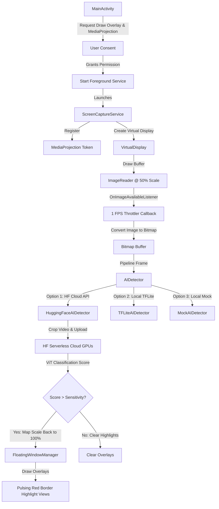

# SlopRadar 📡

SlopRadar is a real-time, privacy-preserving Android application designed to detect and highlight AI-generated "slop" image and video content on your screen in real time. It uses a **Hybrid Edge-Cloud Architecture** that combines on-device computer vision motion tracking with serverless cloud-based deep learning forensic models.

---

## 🚀 Key Features

*   **Pulsing Glowing Highlights**: Draws beautiful, animated overlays directly around detected AI videos and images.
*   **Touch-Through Interaction**: Highlights are fully transparent to inputs, allowing you to scroll or click on videos directly underneath the overlay.
*   **Intelligent Scroll Filtering**: Filters out global screen motion (like general feed scrolling) to prevent false positives, targeting only localized video playback.
*   **Dynamic Model Selector**: Switch between different Hugging Face Vision Transformer (ViT) classification models on the fly directly from the app UI.
*   **Dynamic Sensitivity Tuning**: Use a slider to immediately scale the confidence threshold from `50%` to `99%` without restarting the scanner.
*   **Battery & Performance Optimized**: Throttles the capture loop to `1 FPS` and scales rendering by `50%` to protect CPU, memory, and battery.

---

## 🛠️ Hybrid Architecture



---

## 📋 Prerequisites

Before setting up the project, make sure you have installed:
1.  **Android Studio (Koala or newer)**
2.  **Java Development Kit (JDK 17)** (usually bundled with Android Studio)
3.  **Physical Android Device (API 26 / Android 8.0 or newer)** or an Android Emulator running API Level 34.
    *   *Note: Testing screen projection is highly recommended on a physical device.*

---

## ⚙️ First-Time Setup Instructions

Follow these steps to build and run the application for the first time:

### Step 1: Configure your Hugging Face API Token
To run the cloud-connected SOTA classifier, the app needs a free Hugging Face API User Access Token:
1.  Go to your [Hugging Face Access Tokens Page](https://huggingface.co/settings/tokens).
2.  Click **Create new token**, choose **Read** permissions, and copy the generated token (`hf_...`).
3.  At the root of your cloned project, open the [.env](.env) file:
    ```env
    # Hugging Face User Access Token
    HF_API_TOKEN=hf_yourActualTokenStringHere
    ```
    *Note: The `.env` file is already listed in `.gitignore` to prevent committing your secret API keys to public repositories.*

### Step 2: Open & Sync the Project
1.  Launch **Android Studio** and choose **Open**.
2.  Select the root folder containing this repository (`unsloppable`).
3.  When the project opens, Android Studio will display a yellow banner at the top asking for a Gradle Sync. Click **Sync Now** (or select **File** > **Sync Project with Gradle Files**).
    *   *This generates the `BuildConfig` fields and parses the API token.*

### Step 3: Configure Developer Options on your Phone (Physical Device Only)
1.  On your phone, go to **Settings** > **About Phone**.
2.  Tap the **Build Number** 7 times until you see a message saying *"You are now a developer!"*.
3.  Go back to **Settings** > **System** > **Developer Options** and enable:
    *   **USB Debugging**
    *   **Wireless Debugging** (optional, for debugging over Wi-Fi)
4.  Plug your phone into your computer using a USB cable and tap **Allow USB Debugging** on the prompt.

### Step 4: Perform a Clean Rebuild
1.  In the Android Studio top menu, click **Build** > **Clean Project**.
2.  Then click **Build** > **Rebuild Project**.

### Step 5: Install & Run
1.  Select your phone/emulator in the device dropdown list in Android Studio's top toolbar.
2.  Click the green **Run** button (Play icon).
3.  The app will compile and install on your device.

---

## 📱 How to Use the App

1.  **Grant System Overlay Permission**:
    *   Tap the **ENABLE** button under *Draw Over Other Apps*.
    *   The app will route you to Android's system overlay settings page. Find **SlopRadar** in the list and toggle **Allow display over other apps** to ON.
    *   Press the Back button to return to the app. You should see a green checkmark indicating permission is granted.
2.  **Start the Shield**:
    *   Tap **ACTIVATE RADAR SHIELD**.
    *   Android will present a system dialog warning you that SlopRadar will start capturing everything on your screen. Tap **Start Now**.
    *   A persistent notification badge will appear in your status bar indicating the scanning loop is active.
3.  **Tweak Settings (Optional)**:
    *   **Cloud Model Selection**: Tap any of the three pre-configured Hugging Face endpoints (General ViT, SOTA ViT v6, or Deepfake Classifier) to route queries to that specific model on the fly.
    *   **Sensitivity**: Slide the percentage bar to tune the minimum confidence threshold required to draw warnings (default is `85%`).
4.  **Observe Detection**:
    *   Minimize the app and navigate to YouTube, Instagram, or TikTok.
    *   **Scrolling Rejection**: Scroll rapidly through lists. You'll see that SlopRadar ignores global movement.
    *   **Active Video Highlight**: Find a localized video feed card and let it play. SlopRadar will capture the motion, crop the active coordinates, upload it to Hugging Face, and overlay a pulsing red border with an **AI SLOP DETECTED** warning badge exactly around the video.

---

## 🔌 Switching to Local Inference (Offline TFLite)

If you wish to run the app completely offline without Hugging Face cloud dependencies:
1.  Place your custom object detection model named `slop_detector.tflite` inside the `app/src/main/assets/` folder.
2.  Open [ScreenCaptureService.kt](app/src/main/java/com/example/slopradar/ScreenCaptureService.kt).
3.  Locate `onCreate()` and uncomment the TFLite engine line:
    ```kotlin
    // Option 2: Local TensorFlow Lite Model (Requires slop_detector.tflite in assets)
    aiDetector = TFLiteAIDetector(this)
    ```
4.  Comment out the Hugging Face engine line:
    ```kotlin
    // Option 1: Hugging Face Serverless Cloud API (Real SOTA ViT Model)
    // aiDetector = HuggingFaceAIDetector(this)
    ```
5.  Rebuild and run the app. It will now perform ML inference locally on-device.